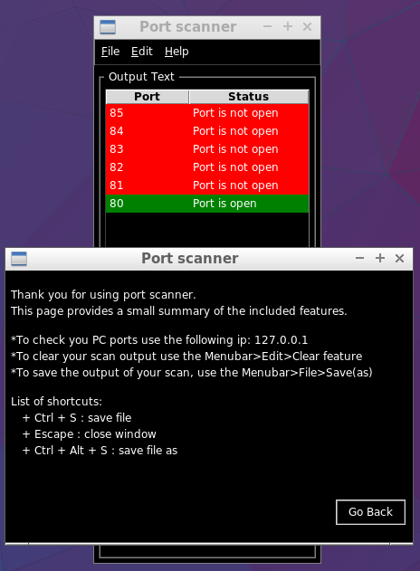

# Port-scanner
This is a gui port scanner developped using python 3. It is based on the tkinter library and includes various menubar functionalities. The code simply iterates through a range of ports targeting a specified ip, tries to establish a socket connection and returns whether the port is open or not.

## Getting Started

These instructions will get you a copy of the project up and running on your local machine for development and testing purposes. 

### Prerequisites

In order to excute this code you will need the following python 3 packages:
* tkinter package
```
sudo apt-get install python3-tk
```

## Tests

This code has been only tested on ubuntu 16.04

## Deployment

This code can be either excuted using a python IDE or by running the following command in the terminal:
```
python3 main.py
```
## Screenshots



## Built With
* [Spyder3](http://pythonhosted.org/spyder/)

## Contributing
If you have any improvement's suggestions, please contact me.

## License

This project is licensed under the MIT License - see the [LICENSE.md](LICENSE.md) file for details

## Acknowledgments

* The nameless heros of Stackoverflow
* etc
